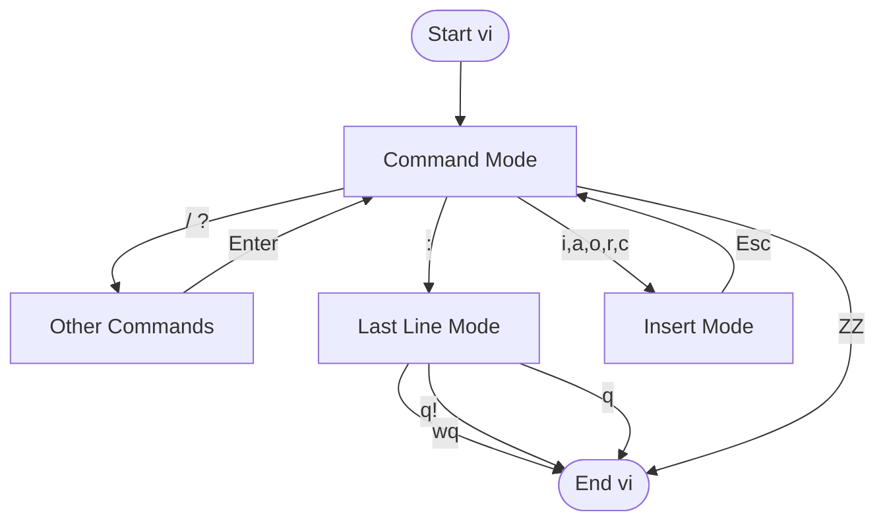

vi is an extremely lightweight text editor with many basic features, usually pre-installed on most Unix systems. Both Ubuntu and macOS come with the vi editor built-in. To flexibly modify text files on systems with only a CLI interface, learning to use the vi editor is essential.

## Getting Started
To use the vi editor, you need to enter the following command in the terminal:
```bash
vi [options] [file(s)]
```
This will open the vi editor, allowing you to edit files through the process described below. Now let's see what we can actually do after entering the vi editor.


## Command Mode
As shown in the flowchart above, after entering the vi editor, you will directly enter Command Mode. In this mode, you can use various commands to **move the cursor**, **edit text**, **copy and paste**, **enter Insert Mode**, **enter Last Line Mode** and more.

These commands follow the syntax below:
```text
[number of times to execute operation] operation [number of targets to act on] target
```

### Moving the Cursor
You can use `Ctrl` + `G` to check the current cursor position. Here are some commonly used cursor movement commands:

| Command | Action |
| --- | --- |
| `1G`, `gg` | Move to the first character of the first line |
| `G` | Move to the first character of the last line |
| `L` | Move to the first character of the last line on the screen |
| `^` | Move to the first non-whitespace character of the current line |
| `0` | Move to the first character of the current line |
| `$` | Move to the last character of the current line |
| `w` | Move to the first character of the next word |
| `b` | Move to the first character of the previous word |
| `}` | Move to the next paragraph |

### Editing Text
| Command | Meaning | Action |
| --- | --- | --- |
| `dd` | delete | Delete the current line |
| `7dd` | delete | Delete the current line and 6 lines below (7 lines total) |
| `d$`, `D` | delete | Delete all characters from the cursor position to the end of the line |
| `5dw` | delete | Delete 5 words |
| `x` | delete | Delete the character under the cursor |
| `X` | delete | Delete the character before the cursor |
| `u` | undo | Undo the last action |

### Copy and Paste
| Command | Action |
| --- | --- |
| `y2W` | Copy two words to the right from the current cursor position |
| `4yb` | Copy four words to the left from the current cursor position |
| `yy` or `Y` | Copy the current line |
| `p` | Paste the copied text after the current cursor position |
| `P` | Paste the copied text before the current cursor position |
| `5p` | Paste the copied text from the buffer after the current cursor position five times |
| `Y` | Copy the current line |
| `yy` | Copy the current line |
| `" x yy` | Copy the current line to register x |
| `ye` | Copy to the end of the word |
| `yw` | Similar to `ye`, but includes the whitespace after the word |
| `y$` | Copy the rest of the line |
| `" x dd` | Delete the current line and store it in register x |
| `" x d` | Delete and store in register x |
| `" x p` | Paste the contents of register x |
| `y]]` | Copy to the next section heading |
| `J` | Join the current line with the next line |
| `gJ` | Similar to `J`, but without inserting a space (vim and gvim) |
| `:j` | Similar to `J` |
| `:j!` | Similar to `gJ` |

### Entering Insert Mode
| Command | Meaning | Action |
| --- | --- | --- |
| `a` | append | Add text after the cursor |
| `A` | append | Add text after the last character of the current line |
| `cw` | change | Enter replace mode until the end of the current word |
| `cc` | change | Delete the entire current line and enter insert mode |
| `c$`, `C` | change | Enter replace mode until the last character of the current line |
| `i` | insert | Add text before the cursor |
| `I` | insert | Add text before the first character of the current line |
| `o` | open | Open a new blank line below the current line and place the cursor there |
| `O` | open | Open a new blank line above the current line and place the cursor there |
| `R` | replace | Enter replace mode, where typed characters overwrite characters under the cursor |
| `s` | substitute | Replace one character and enter insert mode |
| `S` | substitute | Delete the entire line content and enter insert mode |

### Entering Last Line Mode
Simply type `:` to enter Last Line Mode.

## Insert Mode
As the name suggests, this is the mode for entering text. In this mode, you can type text just like in a regular text editor. When you want to return to Command Mode, simply press the `Esc` key.

## Last Line Mode

### File Operations
| Command | Action |
| --- | --- |
| `: n, m w file` | Write lines n through m to a new file |
| `: n, m w >> file` | Append lines n through m to an existing file |
| `:r filename` | Read and insert the contents of filename at the current cursor position |
| `:wq` | Save the buffer and exit |
| `:w` | Save the current buffer and remain in the editor |
| `:w filename` | Save the current buffer to filename |
| `:w! filename` | Overwrite filename with the current content |
| `:w!` | Force write the file (override protection) |
| `:w! file` | Overwrite file with the current content |
| `:w %.new` | Write the current buffer to a file named file.new |
| `:q` | Quit vi (fails if there are unsaved changes) |
| `:q!` | Quit vi without saving the buffer |
| `:Q` | Quit vi and start ex |
| `:vi` | Return to vi after the Q command |
| `ZZ` | Exit vi, saving the file only if changes were made since the last save |
| `%` | Represents the current filename in edit commands |
| `#` | Represents the alternate filename in edit commands |

### Search and Replace
| Command | Action |
| --- | --- |
| `:s/john/jane/` | Replace `john` with `jane` on the current line, once only |
| `:s/john/jane/g` | Replace every occurrence of `john` with `jane` on the current line |
| `:1,10s/big/small/g` | Replace every `big` with `small` on lines 1 through 10 |
| `:1,$s/men/women/g` | Replace every `men` with `women` throughout the entire file |
| `:'<,'>s/this/that/g` | First press `<Ctrl+V>` in Command mode and use arrow keys to select a range, then type `:` to replace `this` with `that` (vim, gvim only) |
| `:s/ \<tim\>/tom/` | Replace only the complete word `tim` with `tom`, not partial matches of `tim` within strings |
| `:%s/terrible/wonderful/gc` | Use the `c` option for interactive replacement of `terrible` with `wonderful` (vim, gvim only) |
| `:%s/^/ \=line(".") . ". "/g` | Permanently add line numbers to the beginning of all lines in the buffer (vim, gvim only) |

### Environment Settings

#### Setting Abbreviations
| Command | Action |
| --- | --- |
| `:ab in out` | Define `in` as an abbreviation for `out` in Insert mode |
| `:unab in` | Remove the abbreviation for `in` |
| `:ab` | List all abbreviations |

#### Setting Mappings
| Command | Action |
| --- | --- |
| `:map string sequence` | Map a character string to a sequence of commands. Use #1, #2, etc. to represent function keys |
| `:unmap string` | Remove the mapping for the character string |
| `:map` | List mapped character strings |
| `:map! string sequence` | Map a character string to a command sequence for input mode |
| `:unmap! string` | Remove the input mode mapping (may need `<Ctrl+V>` to quote characters) |
| `:map!` | List mapped character strings in input mode |
| `qx` | Record typed characters into the register of the specified letter x (vim and gvim) |
| `q` | Stop recording (vim and gvim) |
| `@x` | Execute the register of the specified letter x. Use `@@` to repeat the last `@` command |

#### Setting Options
| Command | Action |
| --- | --- |
| `:set x` | Enable boolean option x, display values of other options |
| `:set nox` | Disable option x |
| `:set x=value` | Set the value of option x |
| `:set` | Display changed options |
| `:set all` | Display all options |
| `:set x?` | Display the value of option x |

> [!TIP]
> If you want to permanently save these environment settings, you can write the desired commands into `.exrc`.
