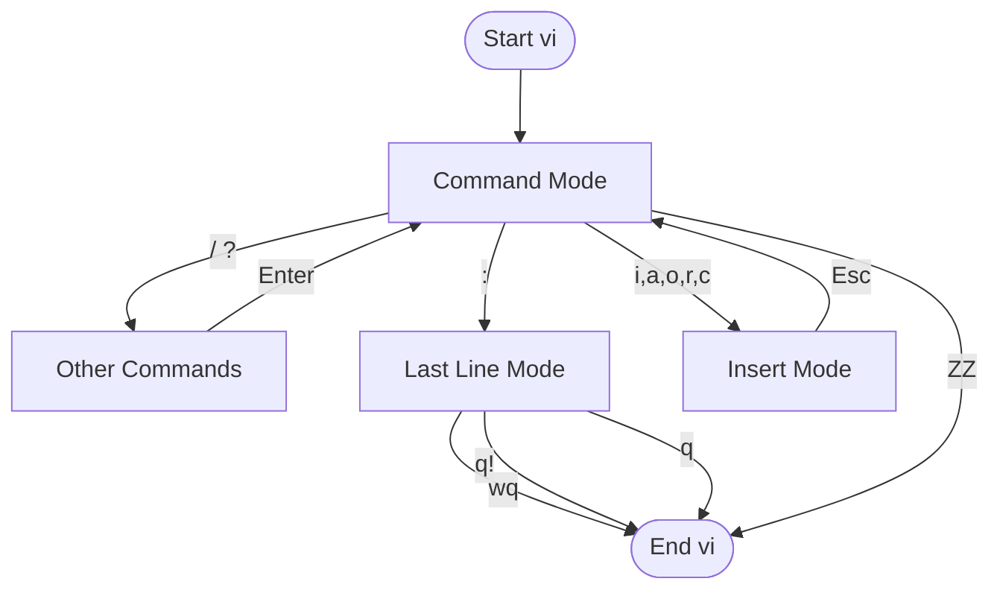

vi 是一個極度輕量且包含許多基礎功能的文字編輯器，通常預設安裝在大多數 Unix 系統中，像是 Ubuntu 或 macOS 都有內建 vi 編輯器，為了在只有 CLI 介面的系統上靈活地修改文字檔案，學會使用 vi 編輯器是非常重要的。

## 開始使用
要使用 vi 編輯器，你需要在終端機中輸入以下指令：
```bash
vi [options] [file(s)]
```
這會開啟 vi 編輯器，使你能透過下方的流程對檔案進行編輯，接下來就讓我們看看進入 vi 編輯器後實際上能做些什麼。


## Command Mode
如上面流程圖所示，進入 vi 編輯器後會直接進到 Command Mode，在這個模式下可以透過各種指令來做到**移動游標**、**編輯文字**、**複製貼上**、**進入 Insert Mode**、**進入 Last Line Mode** 等功能。

而這些指令會以下面的語法呈現：
```text
[要執行幾次 operation] operation [要作用在幾個 target 上] target
```

### 移動游標
可以透過 `Ctrl` + `G` 來查看目前游標所在位置，以下是一些常用的游標移動指令：

| Command | 動作 |
| --- | --- |
| `1G`、 `gg` | 移到第一行的第一個 character |
| `G` | 移到最後一行的第一個 character |
| `L` | 移到畫面上最後一行的第一個 character |
| `^` | 移到 current line 的第一個非空白的 character |
| `0` | 移到 current line 的第一個 character |
| `$` | 移到 current line 的最後一個 character |
| `w` | 移到下一個 word  的第一個 character |
| `b` | 移到上一個 word 的第一個 character |
| `}` | 移到下一個 paragraph |

### 編輯文字
| Command | 意義 | 動作 |
| --- | --- | --- |
| `dd` | delete | 刪除 current line |
| `7dd` | delete | 刪除 current line 及向下 6 個 lines (總共刪 7 lines) |
| `d$`、`D` | delete | 把 cursor 所在位置及以後的 characters 全部刪掉 |
| `5dw` | delete | 刪 5 words |
| `x` | delete | 刪除 cursor 指著的 chararcter |
| `X` | delete | 刪除 cursor 前一位的 character |
| `u` | undo | 返回上一個動作 |

### 複製貼上
| Command | 動作 |
| --- | --- |
| `y2W` | 從目前 cursor 位置向右複製兩個 words |
| `4yb` | 從目前 cursor 位置向左複製四個 words |
| `yy` 或 `Y` |複製目前這一行 |
| `p` | 將被複製的文字放到目前 cursor 位置之後 |
| `P` | 將被複製的文字放到目前 cursor 位置之前 |
| `5p` | 將 buffer 中的被複製的文字放到目前 cursor 位置之後五次 |
| `Y` | 複製目前這一行 |
| `yy` | 複製目前這一行 |
| `" x yy` | 複製目前這一行到 register x |
| `ye` | 複製到 word 結尾 |
| `yw` | 類似 `ye`，但包含 word 後面的空白 |
| `y$` | 複製該行剩餘部分 |
| `" x dd` | 刪除目前這一行並存入 register x |
| `" x d` | 刪除並存入 register x |
| `" x p` | 放入 register x 的內容 |
| `y]]` | 複製到下一個 section heading |
| `J` | 將目前這一行與下一行合併 |
| `gJ` | 類似 `J`，但不插入空格（vim 和 gvim） |
| `:j` | 類似 `J` |
| `:j!` | 類似 `gJ` |

### 進入 Insert Mode
| Command | 意義 | 動作 |
| --- | --- | --- |
| `a` | append | 在 cursor 後面新增字 |
| `A` | append | 在 current line 最後一個字後面新增字 |
| `cw` | change | 開啟 replace mode 直至目前 cursor 所在的 word 的結尾 |
| `cc` | change | 把 current line 整個刪掉後進入 insert mode |
| `c$`、`C` | change | 開啟 replace mode 直至 current line 的最後一個字 |
| `i` | insert | 在 cursor 前面新增字 |
| `I` | insert | 在 current line 第一個字前面新增字 |
| `o` | open | 在 current line 下面開一個新的 blank line 並把 cursor 放到那行上 |
| `O` | open | 在 current line 上面開一個新的 blank line 並把 cursor 放到那行上 |
| `R` | replace | 進入 replace 模式，輸入的字會覆蓋 cursor 在的字 |
| `s` | substitute | replace 一個 character 後進入 insert mode |
| `S` | substitute | 先把整行的內容刪掉之後進入 insert mode |

### 進入 Last Line Mode
直接輸入 `:` 就可以進入 Last Line Mode。

## Insert Mode
如其名，就是輸入文字的模式，在這個模式下你可以像一般文字編輯器一樣輸入文字，當你想要回到 Command Mode 時，只需要按下 `Esc` 鍵即可。

## Last Line Mode

### 檔案相關
| Command | 動作 |
| --- | --- |
| `: n, m w file` | 將第 n 行到第 m 行寫入新檔案 |
| `: n, m w >> file` | 將第 n 行到第 m 行附加到現有檔案 |
| `:r filename` | 在目前 cursor 位置讀取並插入 filename 的內容 |
| `:wq` | 儲存 buffer 並離開 |
| `:w` | 儲存目前 buffer 並留在 editor 中 |
| `:w filename` | 將目前 buffer 儲存到 filename |
| `:w! filename` | 以目前內容覆寫 filename |
| `:w!` | 強制寫入檔案（覆蓋保護） |
| `:w! file` | 以目前內容覆寫 file |
| `:w %.new` | 將目前 buffer 寫入名為 file.new 的檔案 |
| `:q` | 離開 vi（如果有修改過會失敗） |
| `:q!` | 不儲存 buffer 直接離開 vi |
| `:Q` | 離開 vi 並啟動 ex |
| `:vi` | 在 Q 指令後返回 vi |
| `ZZ` | 離開 vi，僅在上次儲存後有修改時才儲存檔案 |
| `%` | 在編輯指令中代表目前的 filename |
| `#` | 在編輯指令中代表替代的 filename |

### 取代與搜尋
| Command | 動作 |
| --- | --- |
| `:s/john/jane/` | 在目前這一行將 `john` 替換為 `jane`，僅一次 |
| `:s/john/jane/g` | 在目前這一行將每個 `john` 都替換為 `jane` |
| `:1,10s/big/small/g` | 在第 1 到第 10 行將每個 `big` 都替換為 `small` |
| `:1,$s/men/women/g` | 在整個檔案中將每個 `men` 都替換為 `women` |
| `:'<,'>s/this/that/g` | 先在 Command mode 中按 `<Ctrl+V>` 並使用方向鍵選取範圍，然後輸入 `:` 將 `this` 替換為 `that`（僅限 vim、gvim） |
| `:s/ \<tim\>/tom/` | 僅替換完整的單字 `tim` 為 `tom`，而非字串中部分匹配的 `tim` |
| `:%s/terrible/wonderful/gc` | 使用 `c` 選項進行互動式替換，將 `terrible` 替換為 `wonderful`（僅限 vim、gvim） |
| `:%s/^/ \=line(".") . ". "/g` | 將 buffer 中所有行的行號永久加到每行開頭（僅限 vim、gvim） |

### 環境設置

#### 設置縮寫
| Command | 動作 |
| --- | --- |
| `:ab in out` | 在 Insert mode 中將 `in` 作為 `out` 的縮寫 |
| `:unab in` | 移除 `in` 的縮寫 |
| `:ab` | 列出所有縮寫 |

#### 設置映射
| Command | 動作 |
| --- | --- |
| `:map string sequence` | 將字元字串映射為一連串指令。使用 #1、#2 等代表 function keys |
| `:unmap string` | 移除字元字串的映射 |
| `:map` | 列出已映射的字元字串 |
| `:map! string sequence` | 將字元字串映射為 input mode 的指令序列 |
| `:unmap! string` | 移除 input mode 的映射（可能需要用 `<Ctrl+V>` 來引用字元） |
| `:map!` | 列出 input mode 中已映射的字元字串 |
| `qx` | 將輸入的字元錄製到指定字母 x 的 register 中（vim 和 gvim） |
| `q` | 停止錄製（vim 和 gvim） |
| `@x` | 執行指定字母 x 的 register。使用 `@@` 重複上一個 `@` 指令 |

#### 設置選項
| Command | 動作 |
| --- | --- |
| `:set x` | 啟用 boolean option x，顯示其他 options 的值 |
| `:set nox` | 停用 option x |
| `:set x=value` | 設定 option x 的值 |
| `:set` | 顯示已變更的 options |
| `:set all` | 顯示所有 options |
| `:set x?` | 顯示 option x 的值 |

> [!TIP]
> 如果想永久保存這些環境設定，可以將想設定的指令寫入 `.exrc` 中。
